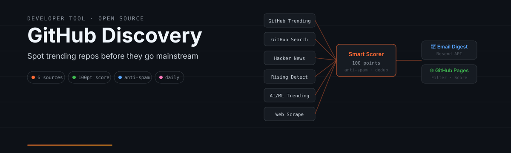

<p align="center">
  
</p>

<p align="center">
  
  
  
  <a href="https://alloevil.github.io/github-discovery/"></a>
</p>

<p align="center">
  <a href="https://alloevil.github.io/github-discovery/">网站</a> · 
  <a href="#快速开始">快速开始</a> · 
  <a href="#功能特性">功能特性</a> · 
  <a href="#开发">开发</a>
</p>

<p align="center">
  <a href="README.md">English</a> | 简体中文
</p>

---

## 这是什么

GitHub Trending 告诉你**今天**什么最火。

GitHub Discovery 告诉你什么**即将火起来**——增长曲线异常的仓库、Hacker News 上的社区精选，以及正在积攒势头的早期项目。

它每天从 6 个数据源采集信号，经过一套智能评分系统（满分 100 分）筛选，最终通过邮件和网页把精选结果送到你面前。

---

## 工作原理

```
  ┌─────────────┐  ┌─────────────┐  ┌─────────────┐
  │   GitHub    │  │   GitHub    │  │   Hacker    │
  │  Trending   │  │   Search    │  │    News     │
  └──────┬──────┘  └──────┬──────┘  └──────┬──────┘
         │                │                │
  ┌──────┴──────┐  ┌──────┴──────┐        │
  │  AI/ML      │  │    Web      │        │
  │  Trending   │  │   Scrape    │        │
  └──────┬──────┘  └──────┬──────┘        │
         │                │                │
         └────────────────┼────────────────┘
                          ▼
              ┌───────────────────────┐
              │    Smart Scorer       │
              │    (100 points)       │
              │  ─────────────────    │
              │  acceleration : 40    │
              │  quality      : 30    │
              │  anti-spam    : 30    │
              └───────────┬───────────┘
                          ▼
              ┌───────────────────────┐
              │  Cross-day Dedup      │
              │  (7-day window)       │
              └───────────┬───────────┘
                          ▼
         ┌────────────────┴────────────────┐
         ▼                                 ▼
  ┌─────────────┐                  ┌─────────────┐
  │ 📧 Email    │                  │ 🌐 GitHub   │
  │   Digest    │                  │    Pages    │
  └─────────────┘                  └─────────────┘
```

---

## 功能特性

### 6 个数据源

| 数据源 | 信号 | 能发现什么 |
|--------|--------|-----------------|
| [GitHub Trending](https://github.com/trending) | 热度 | 每日趋势仓库 |
| GitHub Search | 新晋上升 | 最近 7 天创建、星标增长迅猛的仓库 |
| [Hacker News](https://news.ycombinator.com/) | 社区精选 | Show HN 帖子中出现的 GitHub 仓库 |
| Rising Detection | 早期信号 | Fork 出现异常增长的新仓库（fork farm 比率会被排除） |
| [AI/ML Trending](https://ossinsight.io/trending/ai) | AI 方向 | 快速增长的 AI/ML 仓库（关键词每日轮换） |
| [HF Daily Papers](https://huggingface.co/papers) | 研究信号 | Hugging Face 热门论文关联的 GitHub 仓库——论文点赞往往领先 GitHub 星标好几天 |

### 智能评分（满分 100 分）

| 维度 | 分值 | 衡量什么 |
|-----------|--------|------------------|
| **加速度** | 40 | 真实的日环比星标增长（基于每日快照）+ 相对生命周期均值的加速度 |
| **质量** | 30 | 项目年龄、语言、许可证、内容完整度 |
| **反垃圾** | 30 | Fork 比例、描述质量 |
| **代码质量** | +20 | README、CI 配置、提交频率 |
| **可疑星标** | -15 | 1 天内涨 1000+ 星却没有描述 |
| **批量刷量** | -40 | 同一作者的多个仓库同时暴涨 |

### 反垃圾

- **刷星检测**：1 天内涨 1000+ 星且项目年龄不足 1 天 → 标记
- **批量刷量检测**：同一作者多个仓库同时暴涨 → 标记
- **内容质量**：没有描述或没有 README → 扣分
- **跨日去重**：7 天窗口内不重复推荐

### 邮件订阅

- 每日精选仓库直达你的收件箱
- 双重确认（double opt-in）：点击确认邮件里的链接后订阅才生效
- 每封 digest 都带一键退订链接（含 `List-Unsubscribe` / RFC 8058 头）
- 支持深色模式（Apple Mail / iOS）
- 基于 Resend API 发送

### RSS / Atom 订阅

- 不想留邮箱？用阅读器订阅 Atom feed：
  `https://alloevil.github.io/github-discovery/feed.xml`
- 保留最近约 14 天的推荐，随每日任务自动更新

### GitHub Pages

- 现代、专业的网页界面
- 按日期和语言筛选
- 实时展示评分

---

## 快速开始

### 1. Fork 本仓库

点击右上角的 **Fork** 按钮。

### 2. 配置 Secrets

进入 **Settings → Secrets and variables → Actions**，添加：

| Secret | 必填 | 说明 |
|--------|----------|-------------|
| `RESEND_API_KEY` | ✅ | [Resend](https://resend.com/) API Key，用于发送邮件 |
| `GITHUB_TOKEN` | ❌ | GitHub Personal Access Token（可选，默认使用 GITHUB_TOKEN） |
| `FIRECRAWL_API_KEY` | ❌ | [Firecrawl](https://firecrawl.dev) 的 key。让 GitHub Trending 的解析更健壮（抓取页面而不是正则匹配原始 HTML）。不配置时 Trending 回退为直接抓取 HTML。 |
| `UNSUBSCRIBE_SECRET` | ✅（发邮件时） | 给 digest 邮件里的退订链接签名的随机密钥。必须与 Apps Script 部署的 `UNSUBSCRIBE_SECRET` 脚本属性一致（见下文）。 |

### 3. 部署订阅/退订端点（Google Apps Script）

订阅表单、确认链接、退订链接都由同一个 Apps Script Web App
（`scripts/subscribe_handler.gs`）提供服务：

1. 建一个存订阅者的 Google Sheet，记下其 ID。
2. 打开 [script.google.com](https://script.google.com) 新建项目，粘贴 `scripts/subscribe_handler.gs`，把顶部的 `SHEET_ID` 改成你的。
3. 在 **项目设置 → 脚本属性** 添加：
   - `GITHUB_TOKEN` — 对你 fork 有 `contents: write` 权限的 PAT（用于同步 `subscribers.txt`）。
   - `UNSUBSCRIBE_SECRET` — 一串足够长的随机字符串；与第 2 步 Actions secret 里的 `UNSUBSCRIBE_SECRET` 保持**同一个值**。
4. **部署 → 新建部署 → Web 应用**，执行身份选 **我**，访问权限选 **任何人**，复制 `/exec` URL。
5. 把站点表单和邮件链接指向你的部署：替换 `docs/template.html`（`handleSubscribe`）里的端点 URL，并设置 `SUBSCRIBE_ENDPOINT` 环境变量（或直接改 `scripts/config.py` 里的默认值）。

部署后：新订阅者会先收到确认邮件，点击链接后才开始收 digest；
每封 digest 都带签名的一键退订链接。

### 4. 启用 GitHub Actions

进入 **Actions**，点击 **I understand my workflows, go ahead and enable them**。

### 5. 手动测试

进入 **Actions → Daily Discovery → Run workflow** 触发一次测试运行。

### 6. 查看结果

- **GitHub Pages**：访问 `https://<your-username>.github.io/github-discovery/`
- **邮件**：订阅者每天收到日报

---

## 项目结构

```
github-discovery/
├── scripts/
│   ├── sources.py           # 6 data source collectors
│   ├── scorer.py            # Scoring algorithm
│   ├── quality.py           # Code quality detection
│   ├── anti_spam.py         # Anti-spam scoring dimension
│   ├── dedup.py             # Cross-day deduplication (7-day window)
│   ├── fraud_detection.py   # Batch fraud detection
│   ├── snapshots.py         # Daily star snapshots (real growth)
│   ├── verify_scoring.py    # Scoring verification / backtesting
│   ├── generate_site.py     # GitHub Pages site + Atom feed
│   ├── subscribe_handler.gs # Google Apps Script subscribe endpoint
│   ├── main.py              # Entry point
│   └── config.py            # Configuration
├── tests/                   # Unit tests (pytest)
├── docs/                    # GitHub Pages (index.html, feed.xml)
├── .github/workflows/       # Daily automation
└── subscribers.txt          # Email subscriber list
```

---

## 开发

### 本地运行

```bash
git clone https://github.com/alloevil/github-discovery.git
cd github-discovery
python scripts/main.py
```

### 运行测试

```bash
pip install pytest
python -m pytest tests/ -v
```

### 添加新数据源

1. 在 `scripts/sources.py` 中添加新的 `fetch_xxx()` 函数
2. 在 `fetch_all()` 中调用它
3. 在 `tests/test_sources.py` 中补充测试
4. 提交 PR

### 评分算法

评分逻辑位于 `scripts/scorer.py`，权重可以在 `config.py` 中调整：

```python
SCORING_WEIGHTS = {
    "acceleration": 40,
    "quality": 30,
    "antispam": 30,
}
```

---

## 评分验证

运行回测，验证高分仓库后来是否真的火了。回测直接读取随仓库提交的每日
JSON 报告（`data/discovery-*.json`），全新 clone 无需任何本地状态即可运行：

```bash
python scripts/verify_scoring.py --days 30
```

---

## 参与贡献

欢迎贡献！请按以下步骤操作：

1. Fork 本仓库
2. 创建特性分支：`git checkout -b feature/your-feature`
3. 提交改动：`git commit -m 'feat: add your feature'`
4. 推送分支：`git push origin feature/your-feature`
5. 提交 Pull Request

### 贡献方向

- 📡 添加新数据源
- 🎯 优化评分算法
- 🐛 修复 bug
- 📖 完善文档
- ✅ 补充测试

---

## 许可证

本项目基于 [MIT License](LICENSE) 开源。

---

## 致谢

- [GitHub API](https://docs.github.com/en/rest)
- [Hacker News API](https://github.com/HackerNews/API)
- [OSSInsight](https://ossinsight.io/) —— AI/ML 仓库趋势与分析
- [Resend](https://resend.com/)
- [Firecrawl](https://firecrawl.dev/) —— 为 GitHub Trending 提供健壮的网页抓取

---

<p align="center">
  <strong>⭐ 如果这个项目对你有用，欢迎点个 star！</strong>
</p>
